# Architecture – Store Assistant Pro

> **.NET 10 · WPF · MVVM · CommunityToolkit.Mvvm · Entity Framework Core**
>
> This document is the single source of truth for project structure,
> coding rules, and UI standards. Every contributor and every AI agent
> must follow these rules when adding or modifying code.

---

## 0  High-level overview

### System architecture

```mermaid
graph TB
    subgraph Views ["Views (XAML)"]
        MW[MainWindow]
        MWV[MainWorkspaceView]
        PV[ProductsView]
        SV[SalesView]
        FW[FirmManagementWindow]
        UW[UserManagementWindow]
        SW[SystemSettingsWindow]
        TW[TaxManagementWindow]
        TWK[TasksWindow]
        RBD[ResumeBillingDialog]
        ULW[UnifiedLoginWindow]
        FTSW[FirstTimeSetupWindow]
    end

    subgraph ViewModels ["ViewModels (BaseViewModel)"]
        MVM[MainViewModel]
        MWVM[MainWorkspaceViewModel]
        PVM[ProductsViewModel]
        SVM[SalesViewModel]
        FVM[FirmManagementViewModel]
        UVM[UserManagementViewModel]
        SSVM[SecuritySettingsViewModel]
        GVM[GeneralSettingsViewModel]
        BSVM[BackupSettingsViewModel]
        AIVM[AppInfoViewModel]
        SYSVM[SystemSettingsViewModel]
        TMVM[TaxManagementViewModel]
        TSKVM[TasksViewModel]
        RBVM[ResumeBillingDialogViewModel]
        ULVM[UnifiedLoginViewModel]
        FTSVM[FirstTimeSetupViewModel]
    end

    subgraph Core ["Core Infrastructure — Do Not Redesign"]
        CB[CommandBus]
        CP[CommandPipeline]
        EB[EventBus]
        WM[WorkflowManager]
        NS[NavigationService]
        AS[AppStateService]
        FT[FeatureToggleService]
        SS[SessionService]
        FL[FocusLockService]
        CM[ConnectivityMonitorService]
        OM[OfflineModeService]
    end

    subgraph Commands ["Command Handlers"]
        LH[LoginUserHandler]
        LOH[LogoutHandler]
        FSH[CompleteFirstSetupHandler]
        SPH[SaveProductHandler]
        UPH[UpdateProductHandler]
        DPH[DeleteProductHandler]
        CSH[CompleteSaleHandler]
        CPH[ChangePinHandler]
        MPH[ChangeMasterPinHandler]
        SBH[SaveBillCommandHandler]
        STPH[SaveTaxProfileHandler]
        TTPH[ToggleTaxProfileHandler]
    end

    subgraph Events ["Events (IEvent)"]
        ULE[UserLoggedInEvent]
        ULOE[UserLoggedOutEvent]
        SCE[SaleCompletedEvent]
        FUE[FirmUpdatedEvent]
        PCE[PinChangedEvent]
        BSE[BillingSession Events]
        OME[OperationalModeChangedEvent]
        OFE[OfflineModeChangedEvent]
        HCE[HelpContextChangedEvent]
    end

    subgraph Services ["Services (Business Logic)"]
        PS[ProductService]
        SLS[SalesService]
        FS[FirmService]
        US[UserService]
        LS[LoginService]
        SUS[SetupService]
        SSS[SystemSettingsService]
        DS[DashboardService]
        STS[StartupService]
        TS[TaxService]
        BMS[BillingModeService]
        BSS[BillingSessionService]
        SBMS[SmartBillingModeService]
        QAS[QuickActionService]
    end

    subgraph Data ["Data Layer"]
        DB[(SQL Server<br/>AppDbContext)]
    end

    %% View → ViewModel binding
    MW --> MVM
    MWV --> MWVM
    PV --> PVM
    SV --> SVM
    ULW --> ULVM
    FTSW --> FTSVM

    %% ViewModel → Core
    MVM --> NS
    MVM --> EB
    MVM --> FT
    MVM --> AS
    PVM --> CB
    SVM --> CB
    UVM --> CB

    %% CommandBus → Pipeline → Handlers
    CB --> CP
    CP --> LH
    CP --> LOH
    CP --> FSH
    CP --> SPH
    CP --> UPH
    CP --> DPH
    CP --> CSH
    CP --> CPH
    CP --> MPH
    CP --> SBH
    CP --> STPH
    CP --> TTPH

    %% Handlers → Services
    LH --> LS
    FSH --> SUS
    SPH --> PS
    UPH --> PS
    DPH --> PS
    CSH --> SLS
    CPH --> US
    MPH --> SSS
    SBH --> SLS
    STPH --> TS
    TTPH --> TS

    %% Handlers → EventBus
    LH -.-> ULE
    LOH -.-> ULOE
    CSH -.-> SCE
    CPH -.-> PCE

    %% EventBus dispatches
    ULE -.-> EB
    ULOE -.-> EB
    SCE -.-> EB
    FUE -.-> EB
    PCE -.-> EB
    BSE -.-> EB
    OME -.-> EB
    OFE -.-> EB
    HCE -.-> EB

    %% EventBus → ViewModel subscribers
    EB -.-> MVM
    EB -.-> MWVM

    %% Services → Database
    PS --> DB
    SLS --> DB
    FS --> DB
    US --> DB
    LS --> DB
    SUS --> DB
    SSS --> DB
    DS --> DB
    STS --> DB
    TS --> DB

    %% Workflows
    WM --> STS
    WM --> LS

    %% Connectivity chain
    CM --> OM
    OM --> AS

    %% Session
    SS --> AS

    %% Billing chain
    SBMS --> BMS
    SBMS --> BSS
    SBMS --> FL

    classDef core fill:#1a73e8,stroke:#0d47a1,color:#fff
    classDef vm fill:#34a853,stroke:#1b5e20,color:#fff
    classDef handler fill:#ea8600,stroke:#e65100,color:#fff
    classDef event fill:#ab47bc,stroke:#6a1b9a,color:#fff
    classDef service fill:#5f6368,stroke:#37474f,color:#fff
    classDef data fill:#d32f2f,stroke:#b71c1c,color:#fff
    classDef view fill:#00897b,stroke:#004d40,color:#fff

    class CB,CP,EB,WM,NS,AS,FT,SS,FL,CM,OM core
    class MVM,MWVM,PVM,SVM,FVM,UVM,SSVM,GVM,BSVM,AIVM,SYSVM,TMVM,TSKVM,RBVM,ULVM,FTSVM vm
    class LH,LOH,FSH,SPH,UPH,DPH,CSH,CPH,MPH,SBH,STPH,TTPH handler
    class ULE,ULOE,SCE,FUE,PCE,BSE,OME,OFE,HCE event
    class PS,SLS,FS,US,LS,SUS,SSS,DS,STS,TS,BMS,BSS,SBMS,QAS service
    class DB data
    class MW,MWV,PV,SV,FW,UW,SW,TW,TWK,RBD,ULW,FTSW view
```



### Data flow summary

```
┌─────────────────────────────────────────────────────────────────┐
│                        WRITE PATH                               │
│                                                                 │
│  View ──bind──► ViewModel ──► CommandBus ──► Handler ──► Service│
│                                                │                │
│                                           EventBus              │
│                                                │                │
│                                    Other ViewModels (subscribe) │
└─────────────────────────────────────────────────────────────────┘

┌─────────────────────────────────────────────────────────────────┐
│                        READ PATH                                │
│                                                                 │
│  View ──bind──► ViewModel ──► Service ──► DbContext ──► SQL     │
└─────────────────────────────────────────────────────────────────┘

┌─────────────────────────────────────────────────────────────────┐
│                     WORKFLOW PATH                                │
│                                                                 │
│  App.xaml.cs ──► WorkflowManager ──► IWorkflow.ExecuteStepAsync │
│                       │                    │                    │
│                       │              Services / Dialogs         │
│                       │                                         │
│                  StepResult: Continue → next step               │
│                              Complete → OnCompletedAsync        │
│                              Cancel   → OnCancelledAsync        │
└─────────────────────────────────────────────────────────────────┘
```

### Inheritance hierarchy

```
ObservableObject (CommunityToolkit)
    └── BaseViewModel                    ← Core/Base/
        ├── MainViewModel
        ├── MainWorkspaceViewModel
        ├── ProductsViewModel
        ├── SalesViewModel
        ├── FirmManagementViewModel
        ├── UserManagementViewModel
        ├── UnifiedLoginViewModel
        ├── FirstTimeSetupViewModel
        ├── SystemSettingsViewModel
        ├── GeneralSettingsViewModel
        ├── SecuritySettingsViewModel
        ├── BackupSettingsViewModel
        ├── AppInfoViewModel
        ├── TaxManagementViewModel
        ├── TasksViewModel
        └── ResumeBillingDialogViewModel

    └── PinPadViewModel                  ← Core/Base/ (reusable PIN pad logic)

ICommandHandler<T>
    └── BaseCommandHandler<T>            ← Core/Base/
        ├── LoginUserHandler
        ├── LogoutHandler
        ├── CompleteFirstSetupHandler
        ├── SaveProductHandler
        ├── UpdateProductHandler
        ├── DeleteProductHandler
        ├── CompleteSaleHandler
        ├── ChangePinHandler
        └── ChangeMasterPinHandler

ICommandRequestHandler<TCommand, TResult>  ← Core/Commands/ (pipeline-aware)
        ├── SaveBillCommandHandler
        ├── SaveTaxProfileHandler
        └── ToggleTaxProfileHandler

Window (WPF)
    ├── MainWindow                       ← 90% screen, auto-resize on display change
    ├── BaseDialogWindow                 ← Core/Base/ (fixed size, centered over owner)
    │   ├── FirmManagementWindow
    │   ├── UserManagementWindow
    │   ├── SystemSettingsWindow
    │   ├── TaxManagementWindow
    │   ├── TasksWindow
    │   └── ResumeBillingDialog
    ├── UnifiedLoginWindow               ← Authentication (centered on screen)
    └── FirstTimeSetupWindow             ← Startup (centered on screen)
```

---

## 1  Solution layout

```
StoreAssistantPro/
├── Core/                         # Shared infrastructure (no module dependencies)
│   ├── Base/                     #   BaseViewModel, PinPadViewModel, BasePage, BaseDialogWindow, BaseCommand
│   ├── Commands/                 #   ICommandBus, ICommandHandler, ICommandRequestHandler, CommandResult, Pipeline
│   │   ├── Logging/              #     LoggingPipelineBehavior
│   │   ├── Offline/              #     OfflinePipelineBehavior
│   │   ├── Performance/          #     PerformancePipelineBehavior
│   │   ├── Transaction/          #     TransactionPipelineBehavior
│   │   └── Validation/           #     ValidationPipelineBehavior, ICommandValidator
│   ├── Controls/                 #   ResponsiveContentControl, ViewportConstrainedPanel, InlineTipBanner
│   ├── Data/                     #   PagedResult, PagedQuery
│   ├── Events/                   #   IEventBus, IEvent, OperationalModeChangedEvent, OfflineModeChangedEvent …
│   ├── Features/                 #   FeatureFlags, IFeatureToggleService
│   ├── Helpers/                  #   KeyboardNav, AutoFocus, SelectOnFocus, NumericInput, Motion,
│   │                             #   SmartTooltip, HelpHint, TipBannerAutoState, Watermark, AutoDismiss,
│   │                             #   BillingDimBehavior, BillingFocusBehavior, NotificationBadgeBehavior,
│   │                             #   StatusPillTransition, StyleComplianceDiagnostics, LayoutDiagnostics,
│   │                             #   InputValidator, PinHasher, Converters (PinDot, Equality, InverseBool …)
│   ├── Navigation/               #   INavigationService, NavigationPageRegistry
│   ├── Services/                 #   AppStateService, WindowSizingService, StatusBarService,
│   │                             #   FocusLockService, ConnectivityMonitorService, OfflineModeService,
│   │                             #   TransactionSafetyService, TransactionHelper, ContextHelpService,
│   │                             #   TipRotationService, TipRegistryService, TipStateService,
│   │                             #   OnboardingJourneyService, UserInteractionTracker, OnboardingTipRegistrar,
│   │                             #   NotificationService, PerformanceMonitor, RegionalSettingsService,
│   │                             #   PricingCalculationService, BillCalculationService, TaxCalculationService,
│   │                             #   WindowRegistry, MasterPinValidator, ApplicationInfoService, FileLoggerProvider
│   ├── Session/                  #   ISessionService, SessionService
│   ├── Styles/                   #   DesignSystem.xaml, FluentTheme.xaml, MotionSystem.xaml,
│   │                             #   GlobalStyles.xaml, PosStyles.xaml
│   └── Workflows/                #   IWorkflow, WorkflowManager, WorkflowStep, StepResult, WorkflowContext
├── Data/                         # EF Core AppDbContext + Migrations
├── Models/                       # Domain entities (Product, Sale, SaleItem, UserCredential, BillingSession,
│                                 #   TaxProfile, TaxMaster, TaxProfileItem, AppConfig, AppNotification,
│                                 #   OperationalMode, BillDiscount, BillSummary, LineTotal, TaxBreakdown,
│                                 #   TipDefinition, TipLevel, HelpContext, UserExperienceProfile,
│                                 #   UserExperienceLevel, UserType, BillingSessionState)
├── Modules/                      # Vertical feature slices
│   ├── Authentication/           #   UnifiedLoginWindow, FirstTimeSetupWindow, login/setup workflows
│   ├── Billing/                  #   Billing mode, session lifecycle, auto-save, resume, save-lock
│   ├── Firm/                     #   Firm management dialog
│   ├── MainShell/                #   MainWindow, MainWorkspaceView, Dashboard, TasksWindow, shell services
│   ├── Products/                 #   Product CRUD + QuickActionContributor
│   ├── Sales/                    #   Sale entry + history + offline billing queue
│   ├── Startup/                  #   App bootstrap workflow
│   ├── SystemSettings/           #   Settings window + General/Security/Backup/AppInfo views
│   ├── Tax/                      #   Tax profile management dialog
│   └── Users/                    #   User management dialog
├── Templates/                    # XAML scaffolding templates (PageViewTemplate, DialogWindowTemplate)
├── App.xaml / App.xaml.cs        # Resource dictionaries, DataTemplates, startup
├── HostingExtensions.cs          # DI registration helpers
├── app.manifest                  # PerMonitorV2 DPI awareness
└── StoreAssistantPro.Tests/      # Unit / integration tests
```

---

## 2  Module structure

Each module is a self-contained vertical slice:

```
Modules/<ModuleName>/
├── Commands/       # ICommand + ICommandHandler pairs
├── Events/         # Module-specific IEvent types
├── Models/         # Module-specific DTOs and value objects (optional)
├── Services/       # Module services (interface + implementation)
├── ViewModels/     # ViewModels (derive from BaseViewModel)
├── Views/          # XAML views (derive from BasePage or BaseDialogWindow)
├── Workflows/      # Multi-step flows (optional)
└── <ModuleName>Module.cs   # DI registration + page mapping
```

**Rules:**

- A module may only depend on `Core/`, `Models/`, and `Data/`.
- Modules must never reference another module directly.
- Cross-module communication uses `IEventBus` (publish/subscribe).
- Each module exposes a single `Add<Name>Module()` extension method
  called from `HostingExtensions`.

---

## 3  MVVM wiring

| Concern | Mechanism |
|---|---|
| ViewModel → View | Implicit `DataTemplate` in `App.xaml` |
| Page navigation | `INavigationService.NavigateTo<TViewModel>()` |
| Business actions (legacy) | `ICommandBus.SendAsync<TCommand>(command)` |
| Business actions (pipeline) | `ICommandBus.SendAsync<TCommand, TResult>(command)` |
| Command validation | `ICommandValidator<TCommand>` (pre-execution, auto-resolved) |
| Cross-module events | `IEventBus.PublishAsync<TEvent>(event)` |
| Multi-step flows | `IWorkflowManager.StartAsync(workflowName)` |
| Feature gating | `IFeatureToggleService.IsEnabled(FeatureFlags.X)` |
| Dialog display | `IDialogService.ShowDialogAsync(dialogKey)` |

---

## 4  Base classes

### `BaseViewModel`

Every ViewModel must inherit `BaseViewModel`. It provides:

- `IsBusy` / `IsLoading` — busy-state tracking.
- `ErrorMessage` — first-failure validation display.
- `Validate(builder => ...)` — fluent rule-chain validation.
- `RunAsync(Func<Task>)` — guarded async execution with error capture.
- `Title` — auto-derived from the class name.

### `PinPadViewModel`

Reusable PIN entry base for any dialog requiring numeric PIN input.
Inherits from `BaseViewModel`. Provides:

- Digit entry, backspace, clear commands.
- Max-length enforcement.
- `PinCompleted` callback — fires when PIN reaches `MaxLength` digits.
- `PinDisplay` — masked display string (dots).

### `BasePage`

Every new content page must use `BasePage` as its root XAML element.
It provides:

- `PageTitle` — rendered in the title bar row.
- `HeaderContent` — optional toolbar controls beside the title.
- Error-message bar — auto-bound to `BaseViewModel.ErrorMessage`.
- Loading overlay — auto-bound to `BaseViewModel.IsLoading`.
- Standard 20 px page padding.
- A `*`-sized content row that fills remaining space.

```xml
<core:BasePage x:Class="StoreAssistantPro.Modules.Foo.Views.FooView"
               xmlns:core="clr-namespace:StoreAssistantPro.Core"
               PageTitle="Foo">
    <!-- page content -->
</core:BasePage>
```

### `BaseDialogWindow`

Every modal dialog must inherit `BaseDialogWindow`.
Sizing is set in code-behind only — never in XAML:

```csharp
protected override double DialogWidth  => 500;
protected override double DialogHeight => 400;
```

### `ICommandRequestHandler<TCommand, TResult>` (pipeline-aware)

New command handlers should implement `ICommandRequestHandler<TCommand, TResult>`
instead of `BaseCommandHandler<T>`. Pipeline behaviors wrap automatically:

```csharp
// Command record:
public record SaveBillCommand(...) : ICommandRequest<int>, ITransactionalCommand;

// Handler:
public class SaveBillCommandHandler(ISalesService sales)
    : ICommandRequestHandler<SaveBillCommand, int>
{
    public async Task<CommandResult<int>> HandleAsync(
        SaveBillCommand command, CancellationToken ct)
    {
        var saleId = await sales.CreateSaleAsync(...);
        return CommandResult<int>.Success(saleId);
    }
}

// Validator (optional):
public class SaveBillCommandValidator : ICommandValidator<SaveBillCommand>
{
    public ValidationResult Validate(SaveBillCommand command) { ... }
}
```

---

## 5  UI standards

### 5.1  Grid-first layout

- **Always use `Grid`** as the primary layout panel.
- Reserve `StackPanel` for short, single-axis sequences (a few buttons,
  a label + control pair). Never nest `StackPanel` as the sole child
  of a resizable area — it gives children infinite extent and prevents
  proper resize.
- Use `WrapPanel` for toolbars that may exceed available width.
- Use `DockPanel` for header/footer chrome patterns only.
- Use `UniformGrid` only for fixed-count equal-sized cells (dashboard cards).

### 5.2  Star sizing mandatory

Every page layout must include **exactly one `*`-sized row** (and/or
column where appropriate) so the primary content region stretches to
fill the parent.

```xml
<Grid.RowDefinitions>
    <RowDefinition Height="Auto"/>   <!-- title / toolbar -->
    <RowDefinition Height="Auto"/>   <!-- form fields -->
    <RowDefinition Height="*"/>      <!-- primary data (DataGrid, list, etc.) -->
</Grid.RowDefinitions>
```

### 5.3  Enterprise scroll policy

> **Rule:** `ScrollViewer` must never wrap an entire Window, Dialog, or
> UserControl root. Scroll is only permitted around data-driven content
> that can grow beyond its container.

#### ✅ Allowed

| Context | Why |
|---|---|
| `DataGrid` / `ListView` / `ListBox` in a `*`-sized row | Dynamic row count; grid scrolls internally |
| `ItemsControl` bound to a collection | Dynamic item count |
| Dynamic content pane (`ContentControl` in settings) | Content varies per tab |
| `TextBox` with `AcceptsReturn="True"` + `VerticalScrollBarVisibility="Auto"` | Internal text overflow |
| `ResponsiveContentControl` (main content area) | Shell-level host; `ViewportConstrainedPanel` keeps star rows working |

#### ❌ Disallowed

| Context | Correct approach |
|---|---|
| Login / PIN screen | Fixed `Grid` — keypad fills `*`-row |
| First-time setup dialog | Fixed `Grid` — all fields fit within sized window |
| Firm / User management dialogs | 3-row `Grid`: `Auto` title → `*` form → `Auto` buttons |
| Settings window outer shell | Split-panel: sidebar nav + `ScrollViewer` on content pane only |
| Dashboard page | `UniformGrid` cards in `*`-row — never scrolls |

#### Layout pattern — fixed-size dialog (no scroll)

```xml
<Grid Margin="{StaticResource DialogPadding}">
    <Grid.RowDefinitions>
        <RowDefinition Height="Auto"/>   <!-- Title -->
        <RowDefinition Height="*"/>      <!-- Form body -->
        <RowDefinition Height="Auto"/>   <!-- Buttons pinned to bottom -->
    </Grid.RowDefinitions>

    <TextBlock Style="{StaticResource DialogTitleStyle}" .../>

    <StackPanel Grid.Row="1">
        <!-- fields + error/success messages -->
    </StackPanel>

    <StackPanel Grid.Row="2" Orientation="Horizontal"
                HorizontalAlignment="Right">
        <!-- action buttons -->
    </StackPanel>
</Grid>
```

#### Layout pattern — page with scrollable data area

```xml
<Grid Margin="{StaticResource PagePadding}">
    <Grid.RowDefinitions>
        <RowDefinition Height="Auto"/>   <!-- Page header -->
        <RowDefinition Height="Auto"/>   <!-- Toolbar / filters -->
        <RowDefinition Height="*"/>      <!-- DataGrid (scrolls internally) -->
        <RowDefinition Height="Auto"/>   <!-- Status bar -->
    </Grid.RowDefinitions>

    <DataGrid Grid.Row="2" ItemsSource="{Binding Items}" .../>
</Grid>
```

#### Development-time enforcement

`LayoutDiagnostics` (attached behavior in `Core/Helpers/LayoutDiagnostics.cs`)
runs **DEBUG-only** on every `Window.Loaded` event and writes warnings to
the Visual Studio **Output → Debug** pane when it detects:

- `ScrollViewer` as the `Window.Content` (wraps entire window).
- `ScrollViewer` as a root-panel child spanning all rows.
- `ScrollViewer` whose subtree contains only form controls (no
  `DataGrid`/`ListView`/`ItemsControl`).

Activated globally via `GlobalStyles.xaml`:

```xml
<Setter Property="h:LayoutDiagnostics.IsEnabled" Value="True"/>
```

Opt-out per window: `h:LayoutDiagnostics.IsEnabled="False"`.

### 5.4  No fixed sizes unless required

| Allowed | Forbidden |
|---|---|
| `MaxWidth` / `MaxHeight` on parent `StackPanel` to cap field groups | `Width` + `MaxWidth` set to the same value (redundant, prevents shrink) |
| `MaxHeight` on inline DataGrids (cart, user list) | `Height` on DataGrids inside constrained dialogs |
| Fixed `Width` on narrow input fields (PIN, quantity) | `Width` on full-width TextBox / ComboBox |

**Pattern for constrained form fields:**

```xml
<!-- Width constraint lives on the parent, child stretches within it -->
<StackPanel MaxWidth="400" HorizontalAlignment="Left"
            Margin="{StaticResource FieldGroupSpacing}">
    <TextBlock Text="Firm Name *" Style="{StaticResource FieldLabelStyle}"/>
    <TextBox Text="{Binding FirmName}" MaxLength="200"/>
</StackPanel>
```

### 5.5  DPI-aware application

- The application manifest (`app.manifest`) declares
  **PerMonitorV2** DPI awareness.
- `WindowSizingService` sizes the main window to 90 % of
  `SystemParameters.WorkArea` and re-centres on display changes.
- **Never use pixel-based positioning** (`Canvas.Left`, `Margin` for
  alignment) — use layout panels, `HorizontalAlignment`, and
  `VerticalAlignment`.
- All font sizes, spacing, and padding use the token system in
  `DesignSystem.xaml` which scales naturally at any DPI.

### 5.6  Keyboard navigation

Defined in `Core/Helpers/KeyboardNav.cs` and activated globally via an
implicit `Window` style in `GlobalStyles.xaml`.

#### Enter-key focus flow

Enter is resolved in priority order — the first match wins:

| Priority | Condition | Action |
|---|---|---|
| 0 | `AcceptsReturn` TextBox, Button, open ComboBox | Native behavior (newline, click, select) |
| 1 | `Shift` held | Move focus to previous editable input |
| 2 | Next editable input exists | Move focus to it (skip disabled / read-only) |
| 3 | No editable input ahead + `DefaultCommand` bound, `CanExecute` true | Execute the command (submit) |
| 4 | Fallback | Move focus to next focusable element (button, etc.) |

**Editable inputs** that participate in Enter-key navigation:
`TextBox` (not read-only), `PasswordBox`, `ComboBox`, `DatePicker`.

**Automatically skipped:** disabled controls, `IsReadOnly` TextBoxes,
buttons, text blocks, data grids, and any non-input element.

This gives the natural data-entry flow:

```
Name [TextBox]  →Enter→  Price [TextBox]  →Enter→  Qty [TextBox]  →Enter→  Submit
```

**`DefaultCommand` is an attached property** set on any container element.
The behavior walks up the visual tree from the focused control and
finds the first command.  It only executes after the user has navigated
past the last editable field — **no accidental submits**.

```xml
<!-- Enter walks Name→Price→Qty, then submits on the last one -->
<Grid h:KeyboardNav.DefaultCommand="{Binding SaveCommand}">
    <TextBox Text="{Binding Name}"/>     <!-- Enter → next -->
    <TextBox Text="{Binding Price}"/>    <!-- Enter → next -->
    <TextBox Text="{Binding Qty}"/>      <!-- Enter → submit -->
    <Button Content="Save" Command="{Binding SaveCommand}"/>
</Grid>
```

Bind the **same command** used on the primary action button.  The
command's `CanExecute` guards both the button and the Enter key.

| Key combo | Action |
|---|---|
| **Enter** | Next editable input; if none, execute `DefaultCommand` |
| **Shift+Enter** | Previous editable input |
| **Tab / Shift+Tab** | Standard WPF tab-order navigation |

**Automatic exclusions** (Enter keeps its native meaning):

- `TextBox` with `AcceptsReturn="True"` — Enter inserts a newline.
- `ButtonBase` — Enter invokes the button's own command / click.
- `ComboBox` with drop-down open — Enter selects the highlighted item.

#### Escape-key behavior (tiered)

ESC is resolved in priority order — the first match wins:

| Priority | Condition | Action |
|---|---|---|
| 1 | `EscapeCommand` bound on nearest ancestor | Execute the command |
| 2 | Input control (`TextBox` / `PasswordBox`) focused | Clear focus |
| 3 | None of the above | Don't handle — `IsCancel` buttons work |

**`EscapeCommand` is an attached property** set on any container element.
The behavior walks up the visual tree from the focused control and
executes the first command it finds. This means:

- An **inner form** can override the **dialog-level** close command.
- A **dialog** can override the **window-level** default.

```xml
<!-- Dialog-level: ESC closes (BaseDialogWindow sets this automatically) -->
<core:BaseDialogWindow ...>

    <!-- Form-level: ESC cancels the form (overrides dialog close) -->
    <Border h:KeyboardNav.EscapeCommand="{Binding CancelFormCommand}">
        <!-- form fields -->
    </Border>
</core:BaseDialogWindow>
```

| Window type | Default ESC behavior | Mechanism |
|---|---|---|
| `BaseDialogWindow` | Closes with `DialogResult = false` | Auto-wired `CloseDialogCommand` |
| `MainWindow` | Clears input focus (no command) | Tier 2 fallback |
| Auth windows | Falls through to `IsCancel` buttons | Tier 3 fallback |

To disable auto-close on a specific dialog, override `CloseOnEscape`:

```csharp
protected override bool CloseOnEscape => false;
```

#### Rules

- Tab order follows the WPF visual tree by default. Set `TabIndex` on
  controls only when the visual layout doesn't match the desired
  navigation path (e.g. multi-column forms).
- To disable on a specific container:
  `h:KeyboardNav.IsEnabled="False"`.
- Never add per-window `PreviewKeyDown` handlers for focus, submit, or
  escape logic — the global behavior handles it.
- Never add code-behind `Loaded` handlers to set initial focus — use
  `AutoFocus.IsEnabled` instead.

#### Keyboard shortcut map

**Global (MainWindow — always active):**

| Shortcut | Action |
|---|---|
| `Ctrl+D` | Navigate to Dashboard |
| `Ctrl+P` | Navigate to Products |
| `Ctrl+S` | Navigate to Sales |
| `Ctrl+L` | Logout |
| `F5` | Refresh current view |
| `Alt` | Activate menu bar (WPF built-in) |

**Products page:**

| Shortcut | Action |
|---|---|
| `Ctrl+N` | Open Add Product form |
| `Ctrl+E` | Open Edit Product form |
| `Delete` | Delete selected product |
| `Enter` | Walk fields → save on last field |
| `Escape` | Cancel / close inline form |

**Sales page:**

| Shortcut | Action |
|---|---|
| `Ctrl+N` | Open New Sale form |
| `Enter` | Walk fields → add to cart on last field |
| `Escape` | Cancel / close sale form |

**Dialogs (BaseDialogWindow):**

| Shortcut | Action |
|---|---|
| `Enter` | Walk fields → confirm on last field |
| `Escape` | Close dialog |

**Auth windows:**

| Shortcut | Action |
|---|---|
| `Enter` | Submit (Login / Save) |

**Shortcut rules for future modules (billing, reports):**

- Page-level shortcuts go in `UserControl.InputBindings`.
- Inline form `DefaultCommand` / `EscapeCommand` go on the form's
  container (`Border`, `Grid`) — *not* on the page root.
- Inner commands override outer commands (nearest ancestor wins).
- Use `Ctrl+N` for "New", `Ctrl+E` for "Edit", `Delete` for delete,
  `Escape` for cancel — consistent across all modules.

### 5.7  Auto-focus on load

Defined in `Core/Helpers/AutoFocus.cs` and activated globally via the
implicit `Window` style in `GlobalStyles.xaml`.

When a container with `AutoFocus.IsEnabled="True"` is loaded, the
first focusable input control receives keyboard focus automatically.
Focus target follows `TabIndex` ordering via
`FocusNavigationDirection.First`.

The global `Window` style enables this for every window.  To opt out:

```xml
<Window h:AutoFocus.IsEnabled="False">
```

Per-container activation is also supported for page-level or form-level
auto-focus (e.g. a settings UserControl hosted inside a tab):

```xml
<UserControl h:AutoFocus.IsEnabled="True">
```

### 5.8  Status bar

Defined in `Core/Services/StatusBarService.cs`.  The `IStatusBarService`
is a singleton that any ViewModel or service can inject to post messages.

| Method | Behavior |
|---|---|
| `Post(msg)` | Show message, auto-clear after 4 seconds |
| `Post(msg, duration)` | Show message, auto-clear after custom duration |
| `SetPersistent(msg)` | Show message until replaced or cleared |
| `Clear()` | Revert to `DefaultMessage` ("Ready") |

The XAML binds directly to the service instance exposed by MainViewModel:

```xml
<TextBlock Text="{Binding StatusBar.Message}"/>
```

**Rules:**

- Navigation commands use `SetPersistent` (page context stays visible).
- Transient actions (refresh, dialog close, event) use `Post` (auto-clear).
- Never set status text via direct property assignment — always use the
  service so auto-clear timers are managed correctly.

### 5.9  Inline validation feedback

Defined in `GlobalStyles.xaml` (`InlineValidationErrorTemplate`) and
`BaseViewModel` (`ObservableValidator` base class).

**Visual layer** — implicit styles on all input controls set
`Validation.ErrorTemplate` to a shared `ControlTemplate` that shows:

```
┌ red border (1.5 px) ─────────┐
│  [control]                    │
└───────────────────────────────┘
⚠ Error message text
```

**ViewModel layer** — `BaseViewModel` extends `ObservableValidator`
(CommunityToolkit MVVM), giving every ViewModel `INotifyDataErrorInfo`
support.  Opt in per property:

```csharp
[ObservableProperty]
[NotifyDataErrorInfo]
[Required(ErrorMessage = "Firm name is required.")]
public partial string FirmName { get; set; } = string.Empty;
```

Validation fires automatically when the property changes.  In the
submit command, call `ValidateAllProperties()` to check all at once:

```csharp
ValidateAllProperties();
if (HasErrors) return;
```

**Coexistence:** The existing `Validate()` / `ErrorMessage` pattern
for form-level messages continues to work alongside per-field errors.
Use `[NotifyDataErrorInfo]` for inline field feedback and `Validate()`
for cross-field or server-side error messages.

---

## 6  Spacing & typography system

Defined in `Core/Styles/GlobalStyles.xaml` and merged into `App.xaml`.

### 6.1  Spacing scale (4 px base unit)

| Token | Value | Usage |
|---|---|---|
| `SpacingXs` | 4 | Label → control gap |
| `SpacingSm` | 8 | Inline control gap |
| `SpacingMd` | 12 | Field-group bottom, toolbar gap |
| `SpacingLg` | 16 | Section separator, title margin |
| `SpacingXl` | 20 | Page padding |
| `SpacingXxl` | 24 | Dialog padding |

### 6.2  Pre-built `Thickness` resources

| Key | Value | Use for |
|---|---|---|
| `PagePadding` | `20` | Main content page outer margin |
| `DialogPadding` | `24` | Dialog window outer margin |
| `SectionSpacing` | `0,0,0,16` | Between major visual sections |
| `FieldGroupSpacing` | `0,0,0,12` | Between form-field groups |
| `FieldLabelSpacing` | `0,0,0,4` | Label → control gap |
| `ToolbarSpacing` | `0,0,0,12` | Below toolbars |
| `InlineControlSpacing` | `0,0,8,0` | Between inline toolbar items |
| `TitleSpacing` | `0,0,0,16` | Below page/dialog title |
| `ControlPadding` | `6` | TextBox / PasswordBox / ComboBox |
| `ButtonPadding` | `12,6` | Toolbar buttons |
| `ButtonPaddingLarge` | `16,8` | Primary action buttons |
| `CardPadding` | `16` | Inline form card |

### 6.3  Typography scale

| Key | Size | Role |
|---|---|---|
| `FontSizePageTitle` | 24 | Main content page titles |
| `FontSizeDialogTitle` | 20 | Dialog / settings panel titles |
| `FontSizeSectionHeader` | 16 | In-form section headers |
| `FontSizeBody` | 13 | Standard body text |
| `FontSizeLabel` | 12 | Field labels |
| `FontSizeCaption` | 11 | Captions, footnotes |

### 6.4  Named styles

| Key | Target | Purpose |
|---|---|---|
| `PageTitleStyle` | `TextBlock` | 24 px bold, title margin |
| `DialogTitleStyle` | `TextBlock` | 20 px bold, title margin |
| `SectionHeaderStyle` | `TextBlock` | 14 px semi-bold |
| `FieldLabelStyle` | `TextBlock` | 12 px semi-bold, 4 px bottom |
| `CaptionLabelStyle` | `TextBlock` | 12 px semi-bold, muted |
| `ToolbarButtonStyle` | `Button` | Compact padding + 6 px right gap |
| `PrimaryButtonStyle` | `Button` | Large padding, 13 px semi-bold |
| `FormCardStyle` | `Border` | Card background, radius, padding |
| `ErrorMessageStyle` | `TextBlock` | Red, wrapping |
| `SuccessMessageStyle` | `TextBlock` | Green, wrapping |

### 6.5  Implicit control styles

`TextBox`, `PasswordBox`, `ComboBox`, and `DatePicker` receive default
`Padding` and `VerticalContentAlignment` via implicit styles. Locally
set values on individual controls still take priority.

### 6.6  Input UX behaviors

Defined in `Core/Helpers/` and activated via implicit styles or
per-control attributes.

| Behavior | Class | Activation | Purpose |
|---|---|---|---|
| Smart cursor on focus | `SelectOnFocus` | Implicit `TextBox` style (global) | Text → select all; Numeric → cursor at end |
| Integer-only input | `NumericInput.IsIntegerOnly` | Per-control attribute | Block non-digit typing and paste |
| Decimal-only input | `NumericInput.IsDecimalOnly` | Per-control attribute | Allow digits and one decimal point |

**Smart cursor positioning** is global — every `TextBox` receives
focus-aware cursor behavior via Tab, Enter, or click.  The mode is
auto-detected from existing `NumericInput` attached properties:

| Field type | Detection | On focus |
|---|---|---|
| Text field | No `NumericInput` property | Select all text |
| Numeric field | `IsIntegerOnly` or `IsDecimalOnly` set | Cursor at end of text |
| Multi-line | `AcceptsReturn="True"` | Excluded (no action) |

To opt out:

```xml
<TextBox h:SelectOnFocus.IsEnabled="False"/>
```

**Numeric input** is opt-in per control:

```xml
<TextBox h:NumericInput.IsIntegerOnly="True"/>   <!-- PINs, quantities -->
<TextBox h:NumericInput.IsDecimalOnly="True"/>   <!-- prices, amounts  -->
```

Both modes block invalid characters on typing *and* paste.

---

## 7  Window sizing & dialog standard

### 7.1  Window sizing

| Window | Strategy |
|---|---|
| **MainWindow** | 90 % of `SystemParameters.WorkArea`, centred, `NoResize`. Re-sized on display change. |
| **BaseDialogWindow** | Fixed `DialogWidth` / `DialogHeight` in code-behind, `NoResize`, centred over owner. |
| **Startup windows** | Fixed size via `ConfigureStartupWindow()`, centred on screen, `NoResize`. |

All sizing is programmatic — `Width`, `Height`, `ResizeMode`, and
`WindowStartupLocation` must **never** be set in XAML.

### 7.2  BaseDialogWindow contract

Every modal dialog must inherit `BaseDialogWindow`.  The base class
provides the full enterprise dialog standard automatically:

| Behavior | Mechanism | Opt-out |
|---|---|---|
| Fixed size | `DialogWidth` / `DialogHeight` abstract properties | — (required) |
| No resize | `ResizeMode.NoResize` via `IWindowSizingService` | — |
| Centered over owner | `WindowStartupLocation.CenterOwner` | — |
| Modal | `ShowDialog()` via dialog service | — |
| Enter = confirm | `ConfirmCommand` DP → `KeyboardNav.DefaultCommand` | Don't bind |
| ESC = cancel | `CloseDialogCommand` → `DialogResult = false` | `CloseOnEscape => false` |
| Auto-focus | First input focused on load (global style) | `AutoFocus.IsEnabled="False"` |
| Keyboard nav | Enter/Tab traversal (global style) | `KeyboardNav.IsEnabled="False"` |

**Minimal dialog XAML:**

```xml
<core:BaseDialogWindow x:Class="…"
        xmlns:core="clr-namespace:StoreAssistantPro.Core"
        Title="Edit Item"
        ConfirmCommand="{Binding SaveCommand}">
    <Grid Margin="{StaticResource DialogPadding}">
        <Grid.RowDefinitions>
            <RowDefinition Height="Auto"/>
            <RowDefinition Height="*"/>
            <RowDefinition Height="Auto"/>
        </Grid.RowDefinitions>

        <!-- Row 0: Title -->
        <TextBlock Text="Edit Item" Style="{StaticResource DialogTitleStyle}"/>

        <!-- Row 1: Form body -->
        <StackPanel Grid.Row="1">
            <!-- form fields -->
            <TextBlock Text="{Binding ErrorMessage}" Style="{StaticResource ErrorMessageStyle}"/>
        </StackPanel>

        <!-- Row 2: Actions -->
        <StackPanel Grid.Row="2" Orientation="Horizontal" HorizontalAlignment="Right"
                    Margin="{StaticResource FormActionBarSpacing}">
            <Button Content="💾 Save" Command="{Binding SaveCommand}"
                    Style="{StaticResource PrimaryButtonStyle}"
                    Margin="{StaticResource InlineControlSpacing}"/>
            <Button Content="Close" IsCancel="True"
                    Style="{StaticResource SecondaryButtonStyle}"/>
        </StackPanel>
    </Grid>
</core:BaseDialogWindow>
```

**Minimal dialog code-behind:**

```csharp
public partial class EditItemWindow : BaseDialogWindow
{
    protected override double DialogWidth  => 450;
    protected override double DialogHeight => 350;

    public EditItemWindow(IWindowSizingService sizing, EditItemViewModel vm)
        : base(sizing)
    {
        InitializeComponent();
        DataContext = vm;
    }
}
```

**Key rules:**

- `ConfirmCommand` must bind the **same command** as the primary action
  button.  The command's `CanExecute` guards both the button and Enter.
- Dialogs with multiple tabs / no single primary action (e.g.
  `SystemSettingsWindow`) omit `ConfirmCommand` — sub-views use
  `h:KeyboardNav.DefaultCommand` on their own containers instead.
- `IsCancel="True"` on the cancel button still works alongside the
  base class ESC handling (the base class handles ESC first; if
  `CloseOnEscape` is overridden to `false`, `IsCancel` buttons take
  over).

---

## 8  Responsive content hosting

The main content area uses a three-layer stack:

```
ResponsiveContentControl          ← stretches to fill, defines ScrollViewer
  └─ ScrollViewer                 ← vertical Auto, horizontal Disabled
       └─ ViewportConstrainedPanel  ← passes viewport size as finite constraint
            └─ <Page Content>       ← star-sized rows work correctly
```

- When content fits the viewport → no scrollbar, `*` rows fill space.
- When content exceeds the viewport → vertical scrollbar appears,
  content scrolls naturally.
- This eliminates the classic WPF problem of `*` rows collapsing
  inside a plain `ScrollViewer`.

### Workspace transition animation

When `Content` changes (page navigation, billing-mode toggle, etc.)
`ResponsiveContentControl.OnContentChanged` triggers a combined
fade + slide-up animation:

| Phase | Property | Animation | Duration | Easing |
|-------|----------|-----------|----------|--------|
| Fade  | `PART_ScrollViewer.Opacity` | 0 → 1 | FluentDurationSlow (250 ms) | FluentEaseDecelerate |
| Slide | `PART_SlideTransform.Y` | 12 px → 0 | FluentDurationSlow (250 ms) | FluentEaseDecelerate |

- The slide is opt-in via `EnableSlideTransition="True"` (default).
- Animations are **non-blocking** — the new content receives input
  immediately; the visual transition is purely cosmetic.
- Scroll position resets to top on every content change.
- The initial `Loaded` fade-in is handled by the template's
  `EventTrigger`; subsequent transitions use code-behind for
  reliable content-change detection.

---

## 9  Dependency injection

- **Composition root**: `HostingExtensions.cs` + `App.xaml.cs`.
- Each module registers itself via `Add<Name>Module()`.
- **Lifetimes**:
  - Services (state, session, settings): `Singleton`.
  - Legacy command handlers (`ICommandHandler<T>`): `Transient`.
  - Pipeline-aware handlers (`ICommandRequestHandler<,>`): `Transient`.
  - Command validators (`ICommandValidator<T>`): `Transient`.
  - Pipeline behaviors (`ICommandPipelineBehavior<,>`): `Transient` (open generic).
  - Workflows (`IWorkflow`): `Singleton`.
  - ViewModels: `Transient`.
  - Views / Windows: `Transient`.
  - `DbContextFactory`: `Singleton`; individual `DbContext`: short-lived scoped usage.

---

## 10  Command / event bus

### Commands (legacy — one-to-one, no pipeline)

```
ViewModel  →  ICommandBus.SendAsync<SaveProductCommand>(cmd)
                  ↓
              ICommandHandler<SaveProductCommand>.HandleAsync(cmd)
                  ↓
              CommandResult (Success / Failure + message)
```

### Commands (pipeline-aware — one-to-one, full middleware)

```
ViewModel  →  ICommandBus.SendAsync<SaveBillCommand, int>(cmd)
                  ↓
              CommandExecutionPipeline
                  ├─ ValidationPipelineBehavior   (validates via ICommandValidator<T>)
                  ├─ LoggingPipelineBehavior       (logs name, duration, outcome)
                  ├─ OfflinePipelineBehavior       (rejects if offline + requires DB)
                  ├─ TransactionPipelineBehavior   (wraps in transaction if [Transactional])
                  └─ PerformancePipelineBehavior   (warns on slow commands)
                  ↓
              ICommandRequestHandler<SaveBillCommand, int>.HandleAsync(cmd)
                  ↓
              CommandResult<int> (Success + value / Failure + message)
```

### Events (one-to-many)

```
Handler / Service  →  IEventBus.PublishAsync(new SaleCompletedEvent(...))
                          ↓
                      All subscribers of SaleCompletedEvent are called
```

Events are the **only** mechanism for cross-module communication.

### Registered events

| Event | Publisher | Purpose |
|---|---|---|
| `UserLoggedInEvent` | `LoginUserHandler` | User authenticated; session started |
| `UserLoggedOutEvent` | `LogoutHandler` | User logged out; session cleared |
| `UserLoginSuccessEvent` | `LoginUserHandler` | Successful login (analytics) |
| `UserLoginFailedEvent` | `LoginUserHandler` | Failed login attempt |
| `UserLockedOutEvent` | `LoginUserHandler` | Account locked after max attempts |
| `SaleCompletedEvent` | `CompleteSaleHandler` | Sale finalized; stock deducted |
| `SaleQueuedOfflineEvent` | `CompleteSaleHandler` | Sale queued for offline sync |
| `FirmUpdatedEvent` | `FirmService` | Firm details changed |
| `PinChangedEvent` | `ChangePinHandler` | User PIN updated |
| `OperationalModeChangedEvent` | `AppStateService` | Mode switched (Management ↔ Billing) |
| `OfflineModeChangedEvent` | `OfflineModeService` | Connectivity state changed |
| `ConnectionLostEvent` | `ConnectivityMonitorService` | DB heartbeat failed |
| `ConnectionRestoredEvent` | `ConnectivityMonitorService` | DB heartbeat recovered |
| `HelpContextChangedEvent` | `ContextHelpService` | Help text refreshed |
| `ExperienceLevelPromotedEvent` | `OnboardingJourneyService` | Operator experience level promoted |
| `BillingSessionStartedEvent` | `BillingSessionService` | Billing session created |
| `BillingSessionCompletedEvent` | `BillingSessionService` | Billing session completed |
| `BillingSessionCancelledEvent` | `BillingSessionService` | Billing session cancelled |
| `BillingSessionStateChangedEvent` | `BillingSessionService` | Session state transitioned |
| `CartChangedEvent` | `BillingSessionService` | Cart items modified |
| `PaymentStartedEvent` | `SmartBillingModeService` | Payment processing began |
| `TransactionStartedEvent` | `TransactionSafetyService` | DB transaction opened |
| `TransactionCommittedEvent` | `TransactionSafetyService` | DB transaction committed |
| `TransactionFailedEvent` | `TransactionSafetyService` | DB transaction failed |
| `NotificationPostedEvent` | `NotificationService` | In-app notification created |
| `NotificationsChangedEvent` | `NotificationService` | Notification list changed |

---

## 11  Data access

- **EF Core** with `IDbContextFactory<AppDbContext>`.
- Services create short-lived `DbContext` instances via
  `ITransactionHelper` for unit-of-work scoping.
- Migrations live in `Data/Migrations/`.
- Connection string: `appsettings.json` → `ConnectionStrings:Default`.

---

## 12  Pricing rules

> **Single source of truth for how pricing, tax, and discounts work.**
> Every billing feature, service, and UI must follow these rules.

### Product pricing

- `Product` contains only **`SalePrice`** (the base selling price).
- No MRP, no product-level discount fields.
- `TaxProfileId` (optional) links the product to a GST tax profile.
- `IsTaxInclusive` indicates whether `SalePrice` already includes tax.

### Discount policy

- **Discounts are bill-level only.** Products carry zero discount logic.
- A `BillDiscount` (value object) describes the intent:
  - `DiscountType.None` — no discount.
  - `DiscountType.Amount` — flat currency amount off the subtotal.
  - `DiscountType.Percentage` — percentage off the subtotal (0–100).
- Amount discounts are capped at the subtotal (never negative).
- Discount is applied **before tax** (standard Indian GST trade-discount
  treatment — Section 15, CGST Act).

### Calculation flow

```
Product.SalePrice × Quantity
  → IPricingCalculationService.CalculateLineTotal()   [per-line]
  → LineTotal { Subtotal, TaxAmount, FinalAmount }

Σ line subtotals
  → IBillCalculationService.Calculate()               [whole bill]
  → BillSummary { Subtotal, DiscountAmount, TaxableAmount, TaxAmount, FinalAmount }

GST component split (for invoices)
  → ITaxCalculationService.Calculate()
  → TaxBreakdown { CGST, SGST, IGST }
```

### Service responsibilities

| Service | Scope | Input | Output |
|---|---|---|---|
| `IPricingCalculationService` | Single line item | SalePrice, Qty, Rate, IsTaxInclusive | `LineTotal` |
| `IBillCalculationService` | Entire bill | Subtotal, Rate, `BillDiscount?` | `BillSummary` |
| `ITaxCalculationService` | Tax components | Amount, Rate, IsIntraState | `TaxBreakdown` |

### Persistence

- `Sale` stores `DiscountType`, `DiscountValue`, `DiscountAmount`,
  `DiscountReason` for audit trail.
- `Product` has no discount columns — never add them.

---

## 13  Checklist for new features

1. Create the module folder under `Modules/<Name>/`.
2. Add `<Name>Module.cs` with `Add<Name>Module()` extension method.
3. Register in `HostingExtensions`.
4. ViewModels inherit `BaseViewModel`. PIN dialogs inherit `PinPadViewModel`.
5. Content pages use `BasePage` as root element.
6. Dialog windows inherit `BaseDialogWindow`.
7. Set `ConfirmCommand="{Binding SaveCommand}"` on the dialog window
   element (binds Enter to the primary action).
8. Use `Grid` with `Auto` + `*` row definitions — exactly one `Height="*"` row.
9. Use spacing tokens from `DesignSystem.xaml` — no magic numbers.
10. Use `MaxWidth` on parent `StackPanel` for constrained fields — no
    fixed `Width` on the control itself.
11. Add implicit `DataTemplate` in `App.xaml` for ViewModel → View mapping.
12. Add commands via `ICommandBus`, events via `IEventBus`.
    For new commands, prefer `ICommandRequestHandler<TCommand, TResult>`
    (pipeline-aware) with `ICommandValidator<TCommand>`.
13. Gate visibility behind `IFeatureToggleService` if applicable.
14. Set `TabIndex` on form controls when the visual layout doesn't match
    the desired keyboard navigation order. Enter-key navigation is
    automatic — do not add per-window key handlers.
15. Add `InlineTipBanner` in page Row 1 with `TipBannerAutoState.TipKey`
    and `ContextKey`. Register tip definition in module registrar.
16. Add `h:SmartTooltip.*` properties on key controls for context-aware
    help. Register help keys in `ContextHelpService` rule pipeline.
17. No `ScrollViewer` wrapping entire window — only around data-driven
    content (see `UI_RULES.md §6`).

---

## 14  Architecture freeze

> **CORE SYSTEMS FINALIZED — DO NOT MODIFY**
>
> The architecture described in this document is the production
> baseline. All eight foundation systems listed below are fully
> implemented, tested, and frozen. New features **must integrate
> with** the existing architecture — never bypass, replace, or
> duplicate any of these systems.

### Frozen systems

| # | System | Primary interface(s) | Purpose |
|---|---|---|---|
| 1 | Operational Modes | `IAppStateService.CurrentMode` | Dual-mode shell driving visibility, navigation, and shortcuts |
| 2 | Smart Billing Mode | `SmartBillingModeService`, `IBillingSessionService` | Session lifecycle with safety interlocks |
| 3 | Focus Lock | `IFocusLockService` | Module-level navigation gating during active billing |
| 4 | Offline Safety | `IConnectivityMonitorService`, `IOfflineModeService`, `OfflinePipelineBehavior` | Connectivity monitoring and graceful degradation |
| 5 | Transaction Safety | `ITransactionSafetyService`, `ITransactionHelper`, `TransactionPipelineBehavior` | Mandatory transaction boundaries for financial writes |
| 6 | Command Pipeline | `ICommandPipelineBehavior<,>` (Validation → Logging → Offline → Transaction → Performance) | Automatic cross-cutting concerns on every command |
| 7 | Smart Help System | `IContextHelpService`, `ITipRotationService`, `IOnboardingJourneyService` | Context-aware guidance, tip banners, experience-level adaptation |
| 8 | Modern UI System | `DesignSystem.xaml` → `FluentTheme.xaml` → `MotionSystem.xaml` → `GlobalStyles.xaml` → `PosStyles.xaml` | Centralized tokens, motion, compliance diagnostics |

### What this means for new development

| ✅ Allowed | ❌ Prohibited |
|---|---|
| New modules under `Modules/` that consume existing interfaces | Rewriting or forking any frozen service |
| New `ICommandPipelineBehavior<,>` implementations registered in DI | Removing or reordering existing pipeline behaviors |
| New `IEvent` types published through `IEventBus` | Direct service calls from ViewModels (bypass `ICommandBus`) |
| New pages registering in `NavigationPageRegistry` | Direct `DbContext` usage outside `IDbContextFactory` |
| New tip definitions via `ITipRegistryService` | Inline colors, margins, font sizes, or storyboards in views |
| Extending `IAppStateService` state with new observable properties | Replacing `IAppStateService` with a different state container |
| New `[Transactional]` commands using the pipeline | Financial writes without a transaction boundary |

### Extending the baseline

To add capabilities to a frozen system, follow the existing extension
points — never modify the implementations directly.

| Extension point | How to use |
|---|---|
| New operational mode variant | Add to `OperationalMode` enum; subscribe to `OperationalModeChangedEvent` |
| New pipeline behavior | Implement `ICommandPipelineBehavior<,>` and register in `HostingExtensions` |
| New help context rule | Add a rule class to `ContextHelpService` pipeline; register in `OnboardingTipRegistrar` |
| New motion preset | Add storyboard to `MotionSystem.xaml` and behavior to `Motion.cs` |
| New design token | Add to `DesignSystem.xaml` — never hard-code at the call site |
| New tip banner | `InlineTipBanner` in page Row 1 with `TipBannerAutoState.TipKey` and `ContextKey` |

> **Cross-reference:** The full component inventory with locations and
> DI registrations is in [`DEVELOPMENT_FLOW.md` §Enterprise Architecture
> Baseline](DEVELOPMENT_FLOW.md). The summarised ruleset is in
> [`MASTER_RULES.md`](MASTER_RULES.md).
