# StoreAssistantPro — Architecture Overview

> Visual reference for the full system architecture.
> Render this Mermaid diagram in any Markdown viewer (GitHub, VS Code, etc.).

## System Architecture

```mermaid
graph TB
    subgraph Views ["Views (XAML)"]
        MW[MainWindow]
        DV[DashboardView]
        PV[ProductsView]
        SV[SalesView]
        FW[FirmManagementWindow]
        UW[UserManagementWindow]
        SW[SystemSettingsWindow]
        AW[AuthenticationWindows]
    end

    subgraph ViewModels ["ViewModels (BaseViewModel)"]
        MVM[MainViewModel]
        DVM[DashboardViewModel]
        PVM[ProductsViewModel]
        SVM[SalesViewModel]
        FVM[FirmManagementViewModel]
        UVM[UserManagementViewModel]
        SSVM[SecuritySettingsViewModel]
        GVM[GeneralSettingsViewModel]
    end

    subgraph Core ["Core Infrastructure — Do Not Redesign"]
        CB[CommandBus]
        EB[EventBus]
        WM[WorkflowManager]
        NS[NavigationService]
        AS[AppStateService]
        FT[FeatureToggleService]
        SS[SessionService]
    end

    subgraph Commands ["Command Handlers (BaseCommandHandler)"]
        LH[LoginUserHandler]
        FSH[CompleteFirstSetupHandler]
        SPH[SaveProductHandler]
        UPH[UpdateProductHandler]
        DPH[DeleteProductHandler]
        CSH[CompleteSaleHandler]
        CPH[ChangePinHandler]
        MPH[ChangeMasterPinHandler]
    end

    subgraph Events ["Events (IEvent)"]
        ULE[UserLoggedInEvent]
        SCE[SaleCompletedEvent]
        FUE[FirmUpdatedEvent]
        PCE[PinChangedEvent]
    end

    subgraph Services ["Services (Business Logic)"]
        PS[ProductService]
        SLS[SalesService]
        FS[FirmService]
        US[UserService]
        LS[LoginService]
        SUS[SetupService]
        SSS[SystemSettingsService]
        DS[DashboardService]
        STS[StartupService]
    end

    subgraph Data ["Data Layer"]
        DB[(SQL Server<br/>AppDbContext)]
    end

    %% View → ViewModel binding
    MW --> MVM
    DV --> DVM
    PV --> PVM
    SV --> SVM

    %% ViewModel → Core
    MVM --> NS
    MVM --> EB
    MVM --> FT
    PVM --> CB
    SVM --> CB
    UVM --> CB

    %% CommandBus → Handlers
    CB --> LH
    CB --> FSH
    CB --> SPH
    CB --> UPH
    CB --> DPH
    CB --> CSH
    CB --> CPH
    CB --> MPH

    %% Handlers → Services
    LH --> LS
    FSH --> SUS
    SPH --> PS
    UPH --> PS
    DPH --> PS
    CSH --> SLS
    CPH --> US
    MPH --> SSS

    %% Handlers → EventBus
    LH -.-> ULE
    CSH -.-> SCE
    CPH -.-> PCE

    %% EventBus dispatches
    ULE -.-> EB
    SCE -.-> EB
    FUE -.-> EB
    PCE -.-> EB

    %% EventBus → ViewModel subscribers
    EB -.-> MVM

    %% Services → Database
    PS --> DB
    SLS --> DB
    FS --> DB
    US --> DB
    LS --> DB
    SUS --> DB
    SSS --> DB
    DS --> DB
    STS --> DB

    %% Workflows
    WM --> STS
    WM --> LS

    %% AppState
    SS --> AS
    MVM --> AS

    classDef core fill:#1a73e8,stroke:#0d47a1,color:#fff
    classDef vm fill:#34a853,stroke:#1b5e20,color:#fff
    classDef handler fill:#ea8600,stroke:#e65100,color:#fff
    classDef event fill:#ab47bc,stroke:#6a1b9a,color:#fff
    classDef service fill:#5f6368,stroke:#37474f,color:#fff
    classDef data fill:#d32f2f,stroke:#b71c1c,color:#fff
    classDef view fill:#00897b,stroke:#004d40,color:#fff

    class CB,EB,WM,NS,AS,FT,SS core
    class MVM,DVM,PVM,SVM,FVM,UVM,SSVM,GVM vm
    class LH,FSH,SPH,UPH,DPH,CSH,CPH,MPH handler
    class ULE,SCE,FUE,PCE event
    class PS,SLS,FS,US,LS,SUS,SSS,DS,STS service
    class DB data
    class MW,DV,PV,SV,FW,UW,SW,AW view
```



## Data Flow Summary

```
┌─────────────────────────────────────────────────────────────────┐
│                        WRITE PATH                               │
│                                                                 │
│  View ──bind──► ViewModel ──► CommandBus ──► Handler ──► Service│
│                                                │                │
│                                           EventBus              │
│                                                │                │
│                                    Other ViewModels (subscribe) │
└─────────────────────────────────────────────────────────────────┘

┌─────────────────────────────────────────────────────────────────┐
│                        READ PATH                                │
│                                                                 │
│  View ──bind──► ViewModel ──► Service ──► DbContext ──► SQL     │
└─────────────────────────────────────────────────────────────────┘

┌─────────────────────────────────────────────────────────────────┐
│                     WORKFLOW PATH                                │
│                                                                 │
│  App.xaml.cs ──► WorkflowManager ──► IWorkflow.ExecuteStepAsync │
│                       │                    │                    │
│                       │              Services / Dialogs         │
│                       │                                         │
│                  StepResult: Continue → next step               │
│                              Complete → OnCompletedAsync        │
│                              Cancel   → OnCancelledAsync        │
└─────────────────────────────────────────────────────────────────┘
```

## Module Map

```
StoreAssistantPro/
├── Core/                           ← FROZEN — extend only
│   ├── Base/
│   │   ├── BaseViewModel.cs        ← All ViewModels inherit
│   │   └── BaseCommand.cs          ← All handlers inherit
│   ├── Commands/                   ← CommandBus + interfaces
│   ├── Events/                     ← EventBus + interfaces
│   ├── Features/                   ← FeatureToggleService
│   ├── Helpers/                    ← PinHasher, utilities
│   ├── Navigation/                 ← NavigationService + registry
│   ├── Services/                   ← AppStateService, DialogService
│   ├── Session/                    ← SessionService
│   └── Workflows/                  ← WorkflowManager + interfaces
│
├── Models/                         ← Shared domain models (EF entities)
│   ├── AppConfig.cs
│   ├── AppNotification.cs
│   ├── Product.cs
│   ├── Sale.cs
│   ├── SaleItem.cs
│   └── UserCredential.cs
│
├── Data/
│   └── AppDbContext.cs             ← EF Core context
│
├── Modules/                        ← Feature modules
│   ├── Authentication/             ← Login, first-time setup
│   ├── Billing/                    ← Billing workflow (placeholder)
│   ├── Firm/                       ← Firm management
│   ├── MainShell/                  ← MainWindow, Dashboard, navigation
│   ├── Products/                   ← Product CRUD
│   ├── Sales/                      ← Sales, cart, history
│   ├── Startup/                    ← DB migration, feature loading
│   ├── SystemSettings/             ← Settings, backup, security
│   └── Users/                      ← User/PIN management
│
├── appsettings.json                ← Connection string + feature flags
├── HostingExtensions.cs            ← DI composition root
└── App.xaml.cs                     ← Host bootstrap + workflow start
```

## Inheritance Rules

```
ObservableObject (CommunityToolkit)
    └── BaseViewModel                    ← Core/Base/
        ├── MainViewModel
        ├── DashboardViewModel
        ├── ProductsViewModel
        ├── SalesViewModel
        ├── FirmManagementViewModel
        ├── UserManagementViewModel
        ├── FirstTimeSetupViewModel
        ├── PinLoginViewModel
        ├── GeneralSettingsViewModel
        ├── SecuritySettingsViewModel
        ├── BackupSettingsViewModel
        └── AppInfoViewModel

ICommandHandler<T>
    └── BaseCommandHandler<T>            ← Core/Base/
        ├── LoginUserHandler
        ├── LogoutHandler
        ├── CompleteFirstSetupHandler
        ├── SaveProductHandler
        ├── UpdateProductHandler
        ├── DeleteProductHandler
        ├── CompleteSaleHandler
        ├── ChangePinHandler
        └── ChangeMasterPinHandler

Window (WPF)
    ├── MainWindow                       ← 90% screen, auto-resize on display change
    ├── BaseDialogWindow                 ← Core/Base/ (fixed size, centered over owner)
    │   ├── FirmManagementWindow
    │   ├── UserManagementWindow
    │   └── SystemSettingsWindow
    ├── FirstTimeSetupWindow             ← Startup (centered on screen)
    ├── PinLoginWindow                   ← Startup
    └── UserSelectionWindow              ← Startup
```

## Regional Configuration

```
Global Culture: en-IN (set in App.xaml.cs before DI)
    ├── Currency:  ₹ (Indian Rupee, lakhs/crores grouping)
    ├── Date:      dd-MM-yyyy
    ├── Time:      hh:mm tt
    ├── Timezone:  Asia/Kolkata (IST, UTC+05:30)
    └── FY:        April → March

Formatting Pipeline:
    XAML StringFormat=C  ──► CultureInfo.CurrentCulture (en-IN)
    C# code              ──► IRegionalSettingsService.FormatCurrency/Date/Time/Number
    Timestamps           ──► IRegionalSettingsService.Now (IST)
    DB lockout fields    ──► DateTime.UtcNow (UTC — exception)
```

## Financial Transaction Rules

```
All financial writes MUST use:
    ExecutionStrategy → BeginTransactionAsync → SaveChangesAsync → CommitAsync

    SalesService.CreateSaleAsync     ✅ (sale + stock deduction in single transaction)
    Future: RefundService            ← Must follow same pattern
    Future: BillingService           ← Must follow same pattern
    Future: PaymentService           ← Must follow same pattern

Read-only queries (reports, history) → No transaction required
```
